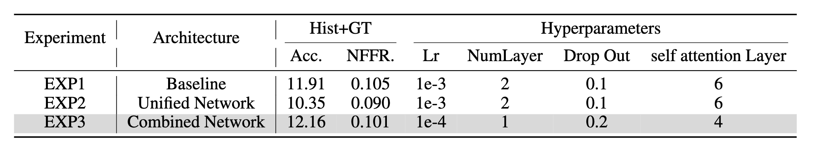

# **Neuro-Symbolic Visual Dialog**
Course project of Machine Perception and Learning class, Winter 2023/24 at Universität Stuttgart.


| Group Member      | University | Field  |
|-----------|-----|-------------|
| Ning Ding  | University of Stuttgart  |  Visual Computing      |
| Sepideh Bahrami | University of Stuttgart  |Autonomous Systems in Computer Science|
| Qiansu Yu| University of Stuttgart  | Autonomous Systems in   Computer Science |

## Introduction

The insparation for Visual dialog comes from the human-human communication[NSVD paper]([URL](https://aclanthology.org/2022.coling-1.17.pdf))
. In human language, a few questions and several rounds of responses can be used to reason about a visual scene. One of the obstacles that models must overcome is creating a link between pronouns like "that" and "it" to the appropriate objects in the scene. Current models encounter different challenges namely,  insufficient training data, poor explainability, and generalization .  A dynamic knowledge base  as well as program generators are main aspects of Neuro-Symbolic Visual Dialog (NSVD) in order to tackling these issues.

The goals of this project are as following:
- Making the original code run (debug and add some parts)
- Making the executor run.
- Create a unified program generator.  
**Extra Part:**
- Combine Encoders (CaptionEncoder + QuestEncoder_1)

**Results Table**



## Data Preprocessing
- The python files for preprocessing and notebook of the creating small dataset can be found in the following folder:
`NSVD-MPL-PRJ/0_preprocess_dialogs`
- The dataset used in this project is called CLEVER Dialog, using this dataset we create our own dataset.


### Note.
 Since the volume of data is too big in this part we also created a smaller dataset from our preprocessed one, making the training and testing procedure faster.
 - Also it is important to mention that small test dataset have 375000 data which takes too long to run in kaggle. Therefore, we sliced it to be 75000.

- The following you can find original and small dataset voulmes:

    | | Caption_train  | Question_train| Question_test|
    |----------|----------|----------|----------|
    |Big_dataset| 349750  |  3497500 |  750000 |
    | Small_dataset | 174875    | 1748750  | 75000  |


## Experiments
#### In this projects we have done several experiments, and you can find the relavent notebooks in the following folders:
- `NSVD-MPL-PRJ/1_original_NSVD` : EXp1
- `NSVD-MPL-PRJ/2_NSVD-Unified-Encod-Arch` : EXP2
- `NSVD-MPL-PRJ/3_NSVD_comb_Encod-Arch` :  : EXP3
------

#### EXP1: This part includes making the baseline code run. 
- There are three notebooks created for this part.
    - `base-cap-tr-final.ipynb`: original architecture
    - `base-ques-tr-final.ipynb`: original architecture
    - `base-ques-test-final-final.ipynb`: original architecture
- You ca find the results for this experiment as following:

    |  | Caption_train| Question_train| Question_test|
    |----------|----------|----------|----------| 
    | Result   |75.80%   | 51.72%  | 11.91%  | 

#### EXP2: This part includes creating the unified version that creates the caption and question programs in one generator.

- There are two notebooks i this part:
    - `unified-train-final-final.ipynb`:same architecture as EXP1
    - `unified-test-final .ipynb` :same architecture as EXP1

- You ca find the results for this experiment as following:
 
    |  | Unified_train|  Question_test|
    |----------|----------|----------|
    | Result   | 50.0%  | 10.35%   | 


#### EXP3: This part is extra part which implemented by us to investigate more improvement. Here we combined the encoders but the caption and question generator programs are running sparately.
- There are three notebooks created for this part.
    - `com-cap-tr-final.ipynb`: changed architecture
    - `com-ques-tr-final.ipynb`: changed architecture
    - `com-ques-test-final.ipynb`: changed architecture

- You ca find the results for this experiment as following:

    |  | Caption_train| Question_train| Question_test|
    |----------|----------|----------|----------| 
    | Result   |75.80%   | 51.72%  | 12.32%  | 


## How to run the project
### Requirements:
- You can run these notebooks in kaggle, which does not need to install anything, but keep in moind because of th GPU limitations you need to run with small dataset. 
- For local run, if you have enough GPU, the required packages are mentioned in `requirement.txt`file    
```
python3 -m pip install -r requirements.txt --user
```
---------------
### Run Preprocessing
1. Enter the `NSVD-MPL-PRJ/0_Data_preprocess` folder and create processed data

```shell
   cd 0_preprocess_dialogs
   python preprocess # Set the flags as appropriate
   # Note: first create train, val, test folder for stack and concat program directly under project, then add three following files ("output_h5.h5", "vocab_input.json", "vocab_output.json") in each of mentioned folders 
   # for gernerating training and validation dataset for stack question program
   python preprocess_dialogs/preprocess.py --input_dialogs_json data/dialogs_train.json --output_vocab_json train_stack/vocab_output.json --output_h5_file train_stack/output_h5.h5 --mode 'stack' --split 'train' --val_size 50 --input_vocab_json train_stack/vocab_input.json 
   python preprocess_dialogs/preprocess.py --input_dialogs_json data/dialogs_train.json --output_vocab_json val_stack/vocab_output.json --output_h5_file val_stack/output_h5.h5 --mode 'stack' --split 'val' --val_size 50 --input_vocab_json val_stack/vocab_input.json 

   # for gernerating test dataset for stack question program
   python preprocess_dialogs/preprocess.py --input_dialogs_json data/dialogs_test.json --output_vocab_json test_stack/vocab_output.json --output_h5_file test_stack/output_h5.h5 --mode 'stack' --split 'test' --val_size 50 --input_vocab_json test_stack/vocab_input.json 

   # for gernerating training and validation dataset for concat question program
   python preprocess_dialogs/preprocess.py --input_dialogs_json data/dialogs_train.json --output_vocab_json train_concat/vocab_output.json --output_h5_file train_concat/output_h5.h5 --mode 'concat' --split 'train' --val_size 50 --input_vocab_json train_concat/vocab_input.json 
   python preprocess_dialogs/preprocess.py --input_dialogs_json data/dialogs_train.json --output_vocab_json val_concat/vocab_output.json --output_h5_file val_concat/output_h5.h5 --mode 'concat' --split 'val' --val_size 50 --input_vocab_json val_concat/vocab_input.json 

   # for gernerating test dataset for concat question program
   python preprocess_dialogs/preprocess.py --input_dialogs_json data/dialogs_test.json --output_vocab_json test_concat/vocab_output.json --output_h5_file test_concat/output_h5.h5 --mode 'concat' --split 'test' --val_size 50 --input_vocab_json test_concat/vocab_input.json 

   # for gernerating dataset for caption program
   # train caption dataset
   python preprocess_dialogs/preprocess.py --input_dialogs_json data/dialogs_train.json --output_vocab_json caption/vocab_caption.json --output_h5_file caption/caption_train.h5 --mode 'concat' --split 'train' --val_size 50 --input_vocab_json caption/vocab_input_caption.json 

   # val caption dataset
   python preprocess_dialogs/preprocess.py --input_dialogs_json data/dialogs_train.json --output_vocab_json caption/vocab_caption.json --output_h5_file caption/caption_val.h5 --mode 'concat' --split 'val' --val_size 50 --input_vocab_json caption/vocab_input_caption.json 


   # test caption dataset
   python preprocess_dialogs/preprocess.py --input_dialogs_json data/dialogs_test.json --output_vocab_json caption/vocab_caption.json --output_h5_file caption/caption_test.h5 --mode 'concat' --split 'test' --val_size 50 --input_vocab_json caption/vocab_input_caption.json 
   
   # train caption parser
   python prog_generator/train_caption_parser.py --mode train --run_dir caption --res_path caption --dataPathTr caption/caption_train.h5 --dataPathVal caption/caption_val.h5 --dataPathTest caption/caption_test.h5 --vocabPath caption/vocab_output_caption.json 

```
2. Run the following notebook to create the smaller dataset
```
0_preprocess_dialogs/make-dataset-smaller.ipynb
```

3. Adjust the experiments hyperparameters as appropriate in ```prog_generator/options_caption_parser.py``` and ```prog_generator/option_question_parser.py```

---
### Run EXP1

- Enter `NSVD-MPL-PRJ/1_original_NSVD/base-cap-tr-final.ipynb`
    - In `optionsC` you have to set the path parameters.
    - Save the .pkl file after training
- Enter the `NSVD-MPL-PRJ/1_original_NSVD/base-cap-tr-final.ipynb`
    - In `optionsC` you have to set the path parameters.
    - Save the .pkl file after training
- Enter the `NSVD-MPL-PRJ/1_original_NSVD/base-ques-test-final.ipynb`
    - Set the parametes especially networkPath parameters in`
        - Set the parametes especially networkPath parameters in `OptionQ`

-----
### Run EXP2
- Enter `NSVD-MPL-PRJ/2_NSVD-Unified-Encod-Arch/unified-test-final.ipynb`
    - In `optionsC` you have to set the path parameters.
    - Set the parametes especially networkPath parameters in `OptionQ`
    - Save the .pkl file after training
- Enter the `NSVD-MPL-PRJ/2_NSVD-Unified-Encod-Arch/unified-train-final-final.ipynb`
-----
### Run EXP3

- Enter `NSVD-MPL-PRJ/3_NSVD_comb_Encod-Arch/com-cap-tr-final.ipynb`
    - In `optionsC` you have to set the path parameters.
    - Save the .pkl file after training
- Enter the `NSVD-MPL-PRJ/3_NSVD_comb_Encod-Arch/com-ques-test-final.ipynb`
    - In `optionsC` you have to set the path parameters.
    - Save the .pkl file after training
- Enter the `NSVD-MPL-PRJ/3_NSVD_comb_Encod-Arch/com-ques-tr-final.ipynb`
    - Set the parametes especially networkPath parameters in`
        - Set the parametes especially networkPath parameters in `OptionQ`


   

